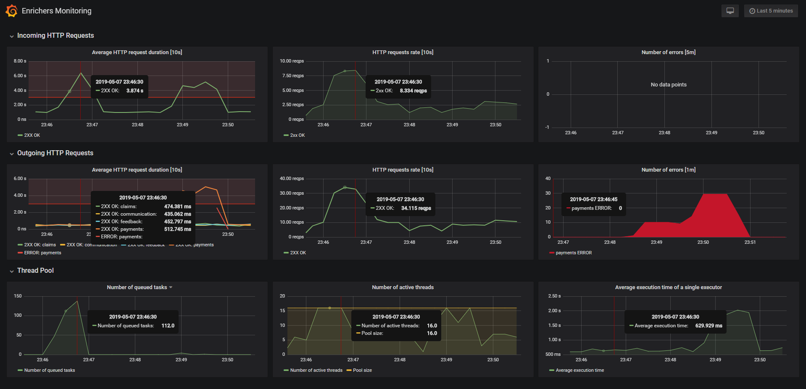
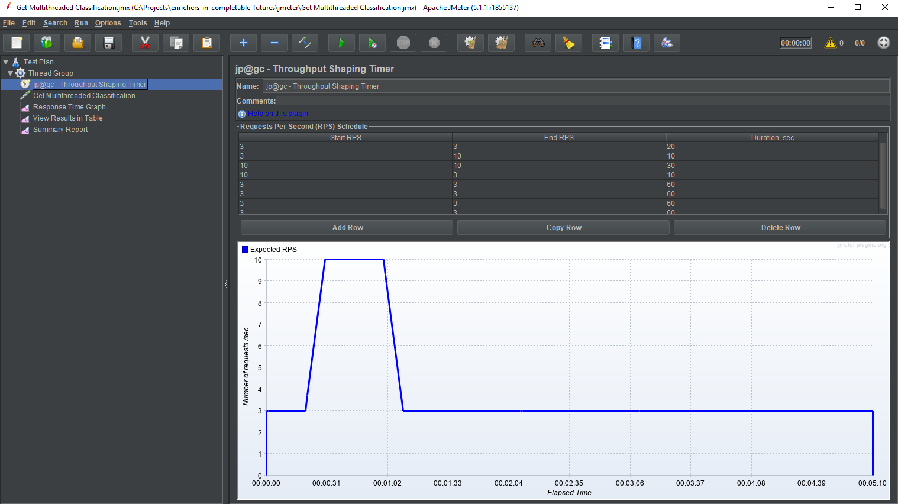

# Enrichers in Completable Futures

## Problem

The topic of the project is to concurrently enrich a single object using data distributed among multiple microservices and external systems. 

We start with an object in some initial state, and in order to move forward with business logic, we need to build the object up. Overall the object is a complex structure, and the data required for further processing is distributed among multiple microservices and external systems.

## Case Study

For example, let's consider an insurance company that would like to classify its customers to present them personalized offers. The company segments their customers into risky, regular and premium. There is a rule engine that performs the classification, and our goal is feed the rule engine with customer's aggregated data. The data happens to be distributed among different departments of the company, which are reflected in microservices.

Each microservice allows getting a distinct aspect of the information related to the customer. In a real life project the list could grow significantly. Here, let's focus only on few of the possible areas.

- [`Payments`](https://github.com/bkaminnski/enrichers-in-completable-futures/tree/master/payments) - keeps track of each insurance premium paid by the customer. It also knows which payments are late. 
- [`Claims`](https://github.com/bkaminnski/enrichers-in-completable-futures/tree/master/claims) - keeps track of the claims made by the customers.
- [`Feedback`](https://github.com/bkaminnski/enrichers-in-completable-futures/tree/master/feedback) - keeps track of the feedback provided by the customers. Additionally, each feedback relates to a particular communication occurrence (when insurance company reached out to the customer), and for each feedback we need to get more details about the communication that feedback relates to. This means that once we get feedback, we need to make another call to [`Communication`](https://github.com/bkaminnski/enrichers-in-completable-futures/tree/master/communication) service which holds complete history of communication with the customer.

The goal of this exercise is to create a [`Classification`](https://github.com/bkaminnski/enrichers-in-completable-futures/tree/master/classification) service that builds up the customer object which can be next processed by the rule engine. We call this object a [`Context`](https://github.com/bkaminnski/enrichers-in-completable-futures/blob/master/classification/src/main/java/com/hclc/enrichers/classification/contextassembler/Context.java) class.

## Challenges

From the architecture point view, this problem could be solved using events. Each service could publish an event. [`Classification`](https://github.com/bkaminnski/enrichers-in-completable-futures/tree/master/classification) service could listen to these events and build local representation of the data required for customer classification. Techniques discussed in the following projects could be helpful in this approach: [kafka-in-spring](https://github.com/bkaminnski/kafka-in-spring), [kafka-streams-in-spring](https://github.com/bkaminnski/kafka-streams-in-spring).

In our case however, the [`Classification`](https://github.com/bkaminnski/enrichers-in-completable-futures/tree/master/classification) service actively calls all other services synchronously. And this makes us think of all the consequence such architectural decision brings.

- Performance: each network call means latency + processing time on the other side. We have to call services concurrently.
- Thread safety: since we decided to call services concurrently, the solution should not only be thread safe today, but also should enforce thread safety as the service evolves in future (it should be hard to break thread safety by design). And one more thing. Though this exercise does  not go that far, in a real project, each [`Context`](https://github.com/bkaminnski/enrichers-in-completable-futures/blob/master/classification/src/main/java/com/hclc/enrichers/classification/contextassembler/Context.java) object had to be persisted as a JPA entity. In the end, the classification object may be also quite complex with sets and lists, which are not thread safe in their most common implementations (like `ArrayList ` or  `HashSet `).
- Reliability: network calls may time out, services might be unavailable. We have to take this into consideration.
- Data consistency: we must not allow any latecomers to break consistency of the object that we have already built up. It means that once we move forward with the business logic of the `Classification` service, no long-running-communication-thread that finally gets response from the other service may mutate the context.

# Solution

## Oh, no...

The naive approach would be to call each external service in a separate thread, passing the  [`Context`](https://github.com/bkaminnski/enrichers-in-completable-futures/blob/master/classification/src/main/java/com/hclc/enrichers/classification/contextassembler/Context.java) object to the thread, effectively concurrently mutating its state. This was also an idea initially suggested by one of our team members. In that solution, each modification of the  [`Context`](https://github.com/bkaminnski/enrichers-in-completable-futures/blob/master/classification/src/main/java/com/hclc/enrichers/classification/contextassembler/Context.java) object was guarded by a client lock, an explicit  `synchronized(lock) {...} ` block. That was fragile. Client locks break encapsulation of synchronization policy. It is easy to forget about the lock in some thread, to lock on a wrong object, or to miss the lock when reading the state of the [`Context`](https://github.com/bkaminnski/enrichers-in-completable-futures/blob/master/classification/src/main/java/com/hclc/enrichers/classification/contextassembler/Context.java). Quoting [Java Concurrency in Practice](https://www.bookdepository.com/Java-Concurrency-in-Practice/9780321349606), *it is a common mistake to assume that synchronization needs to be used only when writing to shared variables; this is simply not true.*

Moving the locks into the [`Context`](https://github.com/bkaminnski/enrichers-in-completable-futures/blob/master/classification/src/main/java/com/hclc/enrichers/classification/contextassembler/Context.java) class itself could probably help a little, at least synchronization policy encapsulation would not be broken in such case. And it would be easier to guarantee that reading of shared variables is also protected by the  `synchronized ` blocks. Still, however, knowing that the class is complex and expected to be further developed over time, it would be too easy to accidentally forget to add `synchronized` keyword to some new method. 

Moreover, there is nothing that could protect against reading and modifying parts of the object concurrently, use it to keep some intermediate values, or expect that some parts of the objects were already built. At the risk of repeating myself, the goal is not only to make the code *somehow* working today, the goal is to come up with a maintainable solution, as easy to reason about as possible.

Finally, client locking and concurrent modification of the [`Context`](https://github.com/bkaminnski/enrichers-in-completable-futures/blob/master/classification/src/main/java/com/hclc/enrichers/classification/contextassembler/Context.java) object do not prevent data inconsistency issue. Suppose that we are waiting for some time for the responses to come and then proceed with calling a rule engine with whatever we got so far. In such case, in order to prevent any late comers from modifying the state after timeout, we would have to apply defensive copying or some other technique that would guarantee data consistency of the [`Context`](https://github.com/bkaminnski/enrichers-in-completable-futures/blob/master/classification/src/main/java/com/hclc/enrichers/classification/contextassembler/Context.java) object.

## A better one?

Why not make concerns separate. The most time consuming operation is fetching data from external services. And this is exactly the part that should be parallelized. Updating the [`Context`](https://github.com/bkaminnski/enrichers-in-completable-futures/blob/master/classification/src/main/java/com/hclc/enrichers/classification/contextassembler/Context.java) is not going to take long. Building up the [`Context`](https://github.com/bkaminnski/enrichers-in-completable-futures/blob/master/classification/src/main/java/com/hclc/enrichers/classification/contextassembler/Context.java) object can be done sequentially by a single thread once all the data is collected in separate threads. So here is the idea for the design.

- We call the process of building up a [`Context`](https://github.com/bkaminnski/enrichers-in-completable-futures/blob/master/classification/src/main/java/com/hclc/enrichers/classification/contextassembler/Context.java) object an *assembly* process.
- A class responsible for `Context` assembly is [`ContextAssembler`](https://github.com/bkaminnski/enrichers-in-completable-futures/blob/master/classification/src/main/java/com/hclc/enrichers/classification/contextassembler/ContextAssemblerMultithreaded.java) (here named `ContextAssemblerMultithreaded` as for sake of this example, there is also a singlethreaded version, [here](https://github.com/bkaminnski/enrichers-in-completable-futures/blob/master/classification/src/main/java/com/hclc/enrichers/classification/contextassembler/ContextAssemblerSinglethreaded.java); it's so much simpler, isnt't it?).
- We start with creating the `Context` object [here](https://github.com/bkaminnski/enrichers-in-completable-futures/blob/master/classification/src/main/java/com/hclc/enrichers/classification/contextassembler/ContextAssemblerMultithreaded.java#L36) and later *enrich* the object with the result of each external service call.
- Each call is wrapped in a `CompletableFuture` and submitted to the well-known (and named) executor service.
  - Having dedicated executor service makes it easier to monitor the thread pool.
  - Using completable futures allows specifying the maximum time we are willing to wait for the result of the complete enrichment process ([here](https://github.com/bkaminnski/enrichers-in-completable-futures/blob/578c1a58d873119026b7bbc6df6d857568a99f3e/classification/src/main/java/com/hclc/enrichers/classification/contextassembler/ContextAssemblerMultithreaded.java#L62)). Our requirements were to proceed with the assembled `Context` regardless of how much data we actually managed to collect. Thus we do not throw any exception on the timeout ([here](https://github.com/bkaminnski/enrichers-in-completable-futures/blob/578c1a58d873119026b7bbc6df6d857568a99f3e/classification/src/main/java/com/hclc/enrichers/classification/contextassembler/ContextAssemblerMultithreaded.java#L70)), nor in case of failure to call the external service ([here](https://github.com/bkaminnski/enrichers-in-completable-futures/blob/578c1a58d873119026b7bbc6df6d857568a99f3e/classification/src/main/java/com/hclc/enrichers/classification/contextassembler/claims/ClaimsEnricher.java#L23-L24)).
  - Completable futures also allow to chain execution of dependent enrichers, as required for `Feedback` and `Communication` services ([here](https://github.com/bkaminnski/enrichers-in-completable-futures/blob/578c1a58d873119026b7bbc6df6d857568a99f3e/classification/src/main/java/com/hclc/enrichers/classification/contextassembler/ContextAssemblerMultithreaded.java#L55)).
- Each stage of the assembly process for the single slice of the `Context` follows a single responsibility principle. Providers make the calls to external services and expose results directly, with no processing ([here](https://github.com/bkaminnski/enrichers-in-completable-futures/blob/master/classification/src/main/java/com/hclc/enrichers/classification/providers/claims/ClaimsProvider.java)). Enrichers handle the outcome of the communication (either a valid result or an error) and create enrichment objects ([here](https://github.com/bkaminnski/enrichers-in-completable-futures/blob/578c1a58d873119026b7bbc6df6d857568a99f3e/classification/src/main/java/com/hclc/enrichers/classification/contextassembler/claims/ClaimsEnricher.java#L21-L24)). Enrichment objects know how to transform data from external services into data relevant to the `Context` being assembled ([here](https://github.com/bkaminnski/enrichers-in-completable-futures/blob/578c1a58d873119026b7bbc6df6d857568a99f3e/classification/src/main/java/com/hclc/enrichers/classification/contextassembler/claims/ClaimsEnrichment.java#L13)). They also know how to apply transformed data to the `Context`. 
- Each enrichment object is immutable thus safe to use outside of the creating thread. According to [Java Concurrency in Practice](https://www.bookdepository.com/Java-Concurrency-in-Practice/9780321349606), an object is immutable if *its state cannot be modified after construction, all its fields are final, and it is properly constructed (the `this` reference does not escape during construction)*. And also *immutable objects can be used safely by any thread without additional synchronization, even when synchronization is not used to publish them*.
- All *enrichment* objects implement [`Enrichment`](https://github.com/bkaminnski/enrichers-in-completable-futures/blob/master/classification/src/main/java/com/hclc/enrichers/classification/contextassembler/Enrichment.java) interface, which allows to apply them to the `Context` object polymorphically, [here](https://github.com/bkaminnski/enrichers-in-completable-futures/blob/578c1a58d873119026b7bbc6df6d857568a99f3e/classification/src/main/java/com/hclc/enrichers/classification/contextassembler/ContextAssemblerMultithreaded.java#L78).

## Monitoring

This exercise also shows how the whole assembly process can be monitored. We are monitoring thread pool and HTTP connections using [micrometer](https://micrometer.io/) for [prometheus](https://prometheus.io/).

- [Here](https://github.com/bkaminnski/enrichers-in-completable-futures/blob/578c1a58d873119026b7bbc6df6d857568a99f3e/classification/pom.xml#L29-L32) is the dependency for micrometer. For metrics to be exposed, we also need spring actuator ([here](https://github.com/bkaminnski/enrichers-in-completable-futures/blob/578c1a58d873119026b7bbc6df6d857568a99f3e/classification/pom.xml#L25-L28)). Together with appropriate [properties configuration](https://github.com/bkaminnski/enrichers-in-completable-futures/blob/578c1a58d873119026b7bbc6df6d857568a99f3e/classification/src/main/resources/application.yml#L17-L30), these two dependencies expose metrics available here: http://localhost:8001/actuator/prometheus.
- To set up thread pool monitoring, we need to use `ExecutorServiceMetrics` to wrap `ThreadPoolExecutor` ([here](https://github.com/bkaminnski/enrichers-in-completable-futures/blob/578c1a58d873119026b7bbc6df6d857568a99f3e/classification/src/main/java/com/hclc/enrichers/classification/config/EnrichersExecutorConfiguration.java#L33)). `MeterRegistry` is already available as spring bean and does not require any additional configuration.
- To set up outgoing HTTP connections, we need to add `MetricsRestTemplateCustomizer` to `RestTemplate` ([here](https://github.com/bkaminnski/enrichers-in-completable-futures/blob/578c1a58d873119026b7bbc6df6d857568a99f3e/classification/src/main/java/com/hclc/enrichers/classification/config/RestTemplateConfiguration.java#L15)). `MetricsRestTemplateCustomizer` is also available with no additional setup.
- We are using prometheus to scrape metrics exposed in actuator. For this exercise, the scraping was configured with 1s interval ([here](https://github.com/bkaminnski/enrichers-in-completable-futures/blob/578c1a58d873119026b7bbc6df6d857568a99f3e/prometheus/prometheus.yml#L12)).
- Prometheus is running as a separate container in docker setup (configured [here](https://github.com/bkaminnski/enrichers-in-completable-futures/tree/master/prometheus) and [here](https://github.com/bkaminnski/enrichers-in-completable-futures/blob/578c1a58d873119026b7bbc6df6d857568a99f3e/docker-compose.yml#L80-L85)).
- Metrics are visualized with [grafana](https://grafana.com/). It's configured [here](https://github.com/bkaminnski/enrichers-in-completable-futures/tree/master/grafana) and [here](https://github.com/bkaminnski/enrichers-in-completable-futures/blob/578c1a58d873119026b7bbc6df6d857568a99f3e/docker-compose.yml#L87-L94). What's interesting, since I have been last writing about prometheus and grafana in 2017 (in [this blog post](http://highcohesionloosecoupling.com/index.php/2017/10/08/jee-performance-jmeter-prometheus-grafana-complete-project-scratch/)), there was a huge progress done in grafa regarding automation. It is now possible to add data sources and dashboards definition files to appropriate folder in the container ([here](https://github.com/bkaminnski/enrichers-in-completable-futures/blob/578c1a58d873119026b7bbc6df6d857568a99f3e/grafana/Dockerfile#L2-L4)) to automatically provision grafana. Nice!

- Finally, in order to produce load and observe the behaviour of the system, there is a JMeter project available [here](https://github.com/bkaminnski/enrichers-in-completable-futures/tree/master/jmeter). What's important about the project, is that in order to generate guaranteed requests per second load, we are using a [Throughput Shaping Timer](https://www.blazemeter.com/blog/using-jmeters-throughput-shaping-timer-plugin) plugin. 
  - What's nice about the plugin is that it allows to program a repeatable scenario of desired load in time.
  - For the throughput shaping plugin to have space to work, a Thread Group has to be configured in JMeter with enough threads to be available. In order to avoid creating all the threads up front, select the *Delay Thread creation until needed* checkbox.
  - In our case, this is 20 seconds of warm up with 3 rps, then 10 seconds of increasing load and keeping the load (10 rps) for another 30 seconds, dropping back to sustainable 3 rps for 10 seconds and keeping it to fill the rest of 5 minutes test.
  - 3-10 rps is far from being impressive, but that's because of parameters taken for example: 500 ms of simulated processing time for each external service and a thread pool limited to 16 threads. Simulated processing time can be changed [here](https://github.com/bkaminnski/enrichers-in-completable-futures/blob/578c1a58d873119026b7bbc6df6d857568a99f3e/docker-compose.yml#L29) and [here](https://github.com/bkaminnski/enrichers-in-completable-futures/blob/578c1a58d873119026b7bbc6df6d857568a99f3e/claims/src/main/resources/application.properties#L3) separately for each service.
  - Additionally, what you can see on the screenshot above of the grafana dashboard, is that one of the services was restarted with higher value of simulated processing time. This is why average outgoing HTTP requests duration for payments service increased in the 4th minute of the test, and the number of errors for payments service started increasing - at the time of service restarts. 

# Running the project

To run the project:

1. clone this repository,
2. compile the project: `mvn clean install`,
3. start docker: `docker-compose up`,
4. endpoints:
    - single threaded assembly: http://localhost:8001/classification/singlethreaded?customerId=45e091bf-edbf-4f80-9dd4-90ad50fe131a,
    - multithreaded assembly: http://localhost:8001/classification/multithreaded?customerId=45e091bf-edbf-4f80-9dd4-90ad50fe131a,
    - metrics: http://localhost:8001/actuator/prometheus,
    - grafana: http://localhost:3000.
  
  # Feedback

  Your feedback is more than appreciated! Please let me know what you think, share your comments, ask questions. Feel free to [create an issue](https://github.com/bkaminnski/enrichers-in-completable-futures/issues) in the project, or just send me an email at bartosz.kaminski@zoho.com. Thank you!